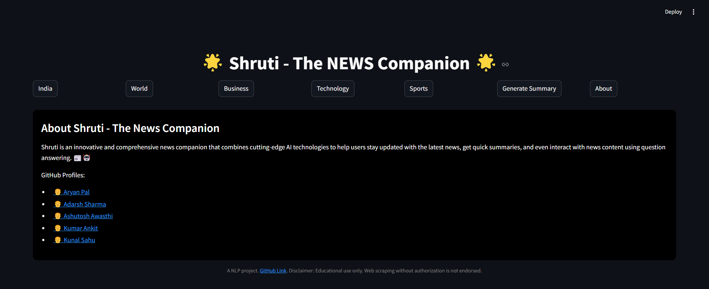
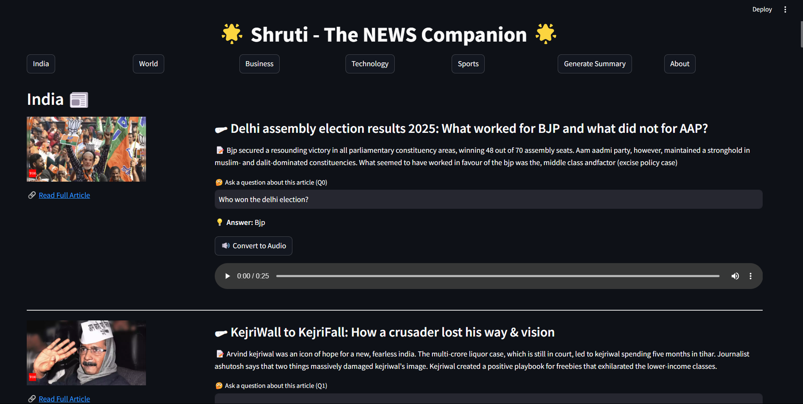
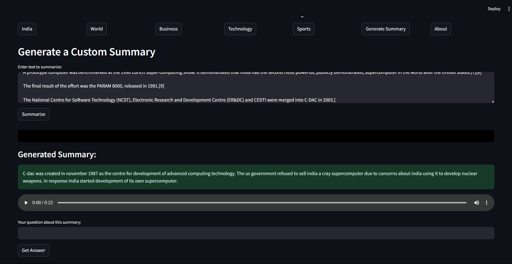

# Shruti-The-News-Companion

Shruti is an innovative and comprehensive news companion that combines cutting-edge AI technologies to help users stay updated with the latest news, get quick summaries, and even interact with news content using question answering. 📰🤖

Features 🚀
1. Web Scraping 🌐
Shruti scrapes the web to gather the latest news articles from the famous Times of India website , ensuring that the user receives the freshest content. 🔄

2. News Classification Using Stacking 📊
Shruti uses an advanced stacking model to classify news articles based on categories. This approach involves stacking multiple classifiers to enhance accuracy and make reliable predictions. 🏆

3. News Summarization 📝
Using BART, Shruti can automatically summarize any news article, presenting only the key points for a quick overview. 📃 Users can input their own content, and Shruti will condense it for easier reading.

4. Text-to-Speech (TTS) 🎤
For accessibility, Shruti uses gTTS to read the summarized text or the answers aloud, so users can listen to the content rather than read it themselves. 🎧

5. User Questionnaire 📝
Shruti includes a DistilBERT-powered questionnaire that helps gather user preferences, improving the overall user experience. 🌱

6. Text Summarization for User-Provided Content ✂️
Shruti allows users to provide their own text, which it will then summarize into a shorter, more concise version. This feature enables users to quickly get the main points from any article or document. 📃

Installation 🔧
To set up the project, follow these steps:

Clone the repository:

bash
Copy
Edit
git clone https://github.com/yourusername/shruti-news-companion.git
cd shruti-news-companion
Install dependencies:

bash
Copy
Edit
pip install -r requirements.txt
Run the app:

bash
Copy
Edit
streamlit run app.py

Model Training for  News Classification 🧑‍💻
For the news classification feature, a stacking classifier has been employed. The following models are used in the stack:

Base Models:
Naive Bayes (Multinomial) 📚
SVC (Support Vector Classifier) 🧳
Random Forest 🌳
Meta-Model:
Logistic Regression ⚖️
This stacking technique takes the predictions of each base model and feeds them into the Logistic Regression model as a meta-classifier to make the final prediction.

Usage 💡
Get News: The app will automatically pull the latest news articles and classify them. 📰
Summarize News: Users can input any text, and Shruti will generate a concise summary. ✂️
Listen to Summaries: Enable the TTS feature to listen to the summarized content. 🎧

SnapShots

Technologies Used 💻
Python: Primary programming language 🐍
Streamlit: For building the interactive app 🌊
BART: For text summarization 🔠
DistilBERT: For the user questionnaire model 🧠
gTTS: For text-to-speech functionality 🎙️
scikit-learn: For machine learning models (stacking classifier) ⚙️
Matplotlib For visualizations 📊

Acknowledgments 🙏
Hugging Face for providing the pre-trained BART and DistilBERT models. 🤗
Streamlit for enabling easy app development. 🌐
gTTS for simplifying text-to-speech integration. 🔊

